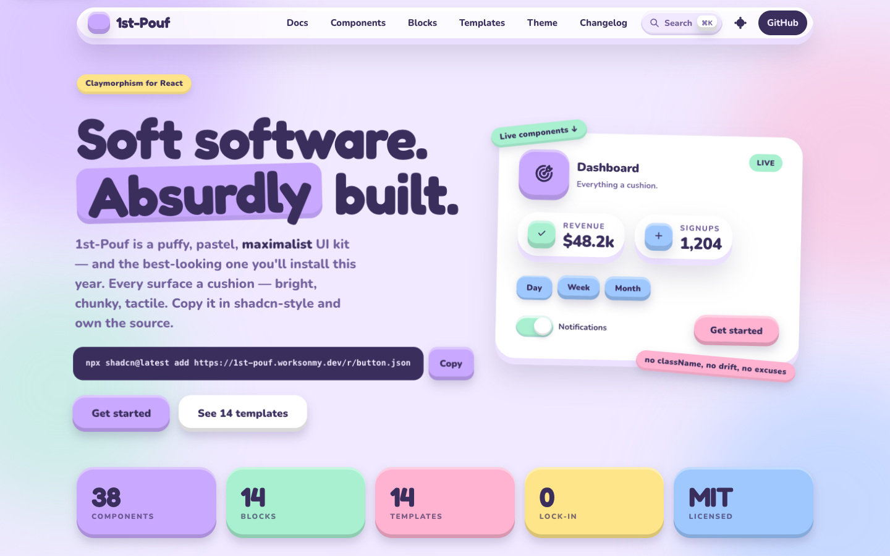
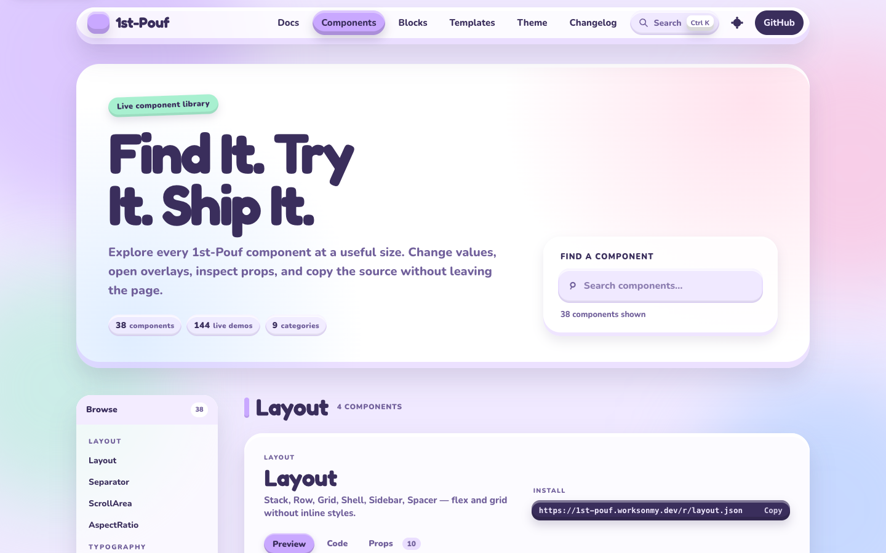
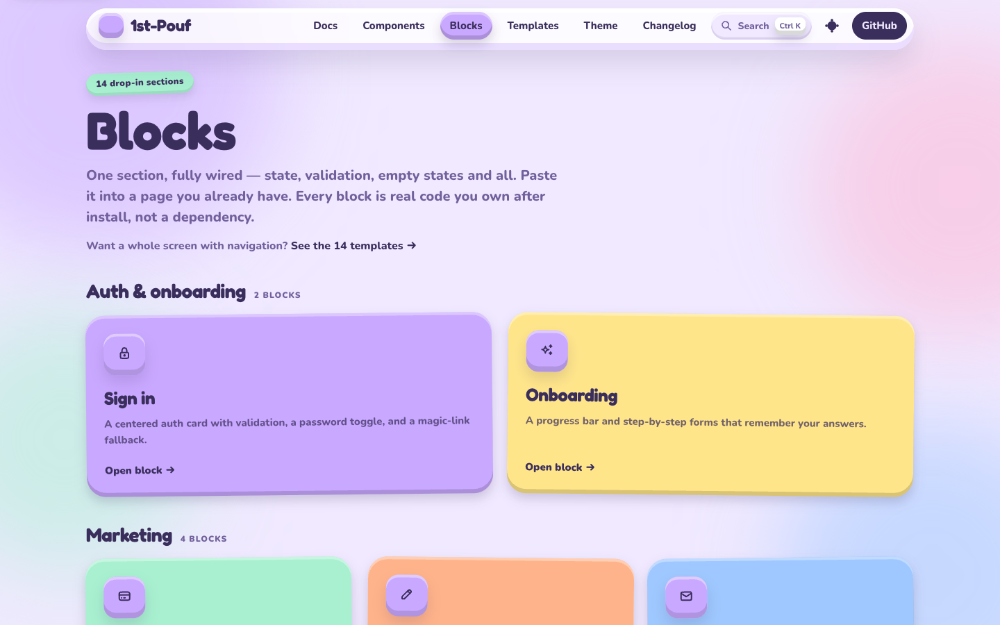

# 1st-Pouf

**A puffy, pastel, kid-shaped UI kit for React.** Claymorphism — like neumorphism but maximalist: bright, chunky, every surface a cushion. Distributed as a shadcn-style registry, so you copy the source into your project and own it.

**[Live site](https://1st-pouf.worksonmy.dev)** ·
**[Components](https://1st-pouf.worksonmy.dev/components)** ·
**[Blocks](https://1st-pouf.worksonmy.dev/blocks)** ·
**[Templates](https://1st-pouf.worksonmy.dev/examples)** ·
**[Registry](https://1st-pouf.worksonmy.dev/r/registry.json)**

> Every surface a cushion. Big radius. Inner highlight. Inner floor shadow. Outer drop. Pastel everywhere.

## Preview

Try every component, block, and template in the browser without an account or
local setup. The live galleries are the fastest way to decide whether the
claymorphism system fits your product.

[](https://1st-pouf.worksonmy.dev)

| [Live component catalog](https://1st-pouf.worksonmy.dev/components) | [Ready-to-install blocks](https://1st-pouf.worksonmy.dev/blocks) |
| --- | --- |
| [](https://1st-pouf.worksonmy.dev/components) | [](https://1st-pouf.worksonmy.dev/blocks) |

- **Depth is the affordance.** Buttons press in; badges stay flat. State you can feel, not just read.
- **You own the source.** Install with the shadcn CLI or copy the file. There is no 1st-Pouf runtime package to version-lock.
- **Variants, not classNames.** Appearance is chosen by props, so your app can't drift off-system. Need an escape hatch? You have the code.
- **Built on** Tailwind CSS v4, Radix UI, `class-variance-authority`, and Recharts.
- **71 installable registry items.** 40 UI entries plus 28 complete blocks and templates, with live previews before you copy anything.

## Install

1st-Pouf needs a React app with **Tailwind CSS v4** and the **shadcn CLI** configured (a `components.json`).

```bash
# the theme (tokens, cushion utilities, keyframes) — comes along automatically,
# but you can add it explicitly
npx shadcn@latest add https://1st-pouf.worksonmy.dev/r/base.json

# a component (pulls in its dependencies + the base)
npx shadcn@latest add https://1st-pouf.worksonmy.dev/r/button.json
```

Import the theme and the font once in your app entry:

```ts
import '@fontsource-variable/nunito'
import './components/pouf/pouf.css'
```

Then use it:

```tsx
import { Button } from './components/pouf/Button'

export function Example() {
  return <Button tone="mint">Save</Button>
}
```

To exercise the same consumer-facing imports from this repository without
starting the gallery or a test runner:

```bash
bun run example:consumer
```

The command renders a small Card, Stack, Heading, Text, and Button composition
through React's server renderer and prints the resulting accessible markup.

Browse every component live at **[1st-pouf.worksonmy.dev](https://1st-pouf.worksonmy.dev)**.

## Compatibility

- React 18.3.1 and React 19
- Tailwind CSS 4
- Vite, Next.js, or Astro with React
- Modern evergreen browsers; keyboard and reduced-motion behavior are included

## Components

Layout (Stack, Row, Grid, Shell, Sidebar, Separator, ScrollArea, AspectRatio) ·
Typography (Heading, Text, Highlight, Eyebrow) ·
Surfaces (Card, RowCard, Stat, Metric, Blob, Badge, Dot, Figure, Avatar) ·
Forms (Button, Input, Textarea, NumberInput, Checkbox, RadioGroup, Slider, Segmented, ToggleGroup) ·
Overlays (Select, Switch, Dialog, Confirm, Tooltip, Combobox, DropdownMenu, HoverCard, Sheet) ·
Feedback (Status, Freshness, ModeBanner, Empty, Skeleton, ErrorNote, Toasts, AlertBell, Progress) ·
Navigation (Tabs, Accordion, Collapsible, NavLink, BottomNav, Breadcrumb, Pagination) ·
Data (Table, Charts).

## Testing copied components

Because 1st-Pouf installs source into your application, test it through the
behavior your users observe. The opt-in [consumer testing guide](./docs/testing.md)
includes Vitest/jsdom setup plus copy-paste Button and NumberInput tests. Test
files and runner configuration stay in your application; registry installs do
not add or overwrite them.

## The one rule

No component takes a `className` or `style` prop. That is deliberate: it is what keeps a whole app on-system. Choose appearance with variants (`tone`, `size`, `variant`). When you genuinely need to break out, edit the source — it's yours.

## Development

1st-Pouf is a bun-workspaces monorepo:

- `registry/pouf/` — the library source (what users receive) + `pouf.css` theme + demos
- `gallery/` — a Vite app that renders every demo, driving the snapshot-equivalence gate
- `www/` — the [1st-pouf.worksonmy.dev](https://1st-pouf.worksonmy.dev) site (Astro), which runs on 1st-Pouf itself

```bash
bun install
bun run example:consumer  # render public component APIs without the gallery
bun run gallery      # the demo gallery at :4700
bun run gate         # the snapshot gate (computed styles + pixels)
bun test             # unit tests
bun run social:preview # rebuild docs/social-preview.png at 1280x640
```

See [CONTRIBUTING.md](./CONTRIBUTING.md) for the workflow and the gate.
The repository-ready social preview is at
[`docs/social-preview.png`](./docs/social-preview.png).

## Credits

1st-Pouf's visual language is adapted from [novusgfx/retro-design-system](https://github.com/novusgfx/retro-design-system) (`styles/39-claymorphism`), which is MIT licensed. One deliberate deviation from the reference: ink on pastel, never white — the reference's white-on-pastel buttons fail WCAG AA (measured 1.25:1–1.99:1); 1st-Pouf uses ink uniformly (6.10:1–9.75:1).

## License

MIT © Mojtaba Beheshti
